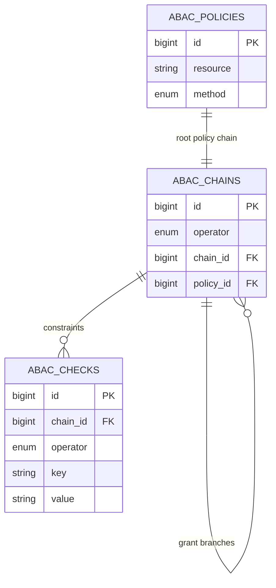
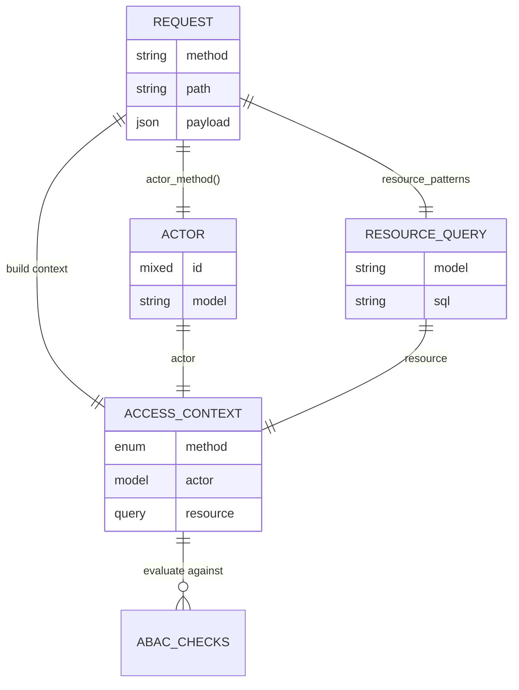

# Architecture Diagrams

## Permission Storage ER Diagram

```mermaid
erDiagram
    ABAC_POLICIES ||--|| ABAC_CHAINS : "root policy chain"
    ABAC_CHAINS ||--o{ ABAC_CHAINS : "grant branches"
    ABAC_CHAINS ||--o{ ABAC_CHECKS : "constraints"

    ABAC_POLICIES {
        bigint id PK
        string resource
        enum method
    }

    ABAC_CHAINS {
        bigint id PK
        enum operator
        bigint chain_id FK
        bigint policy_id FK
    }

    ABAC_CHECKS {
        bigint id PK
        bigint chain_id FK
        enum operator
        string key
        string value
    }
```

## Runtime Evaluation Context Diagram

```mermaid
erDiagram
    REQUEST ||--|| ACTOR : "actor_method()"
    REQUEST ||--|| RESOURCE_QUERY : "resource_patterns"
    REQUEST ||--|| ACCESS_CONTEXT : "build context"
    ACTOR ||--|| ACCESS_CONTEXT : "actor"
    RESOURCE_QUERY ||--|| ACCESS_CONTEXT : "resource"
    ACCESS_CONTEXT ||--o{ ABAC_CHECKS : "evaluate against"

    REQUEST {
        string method
        string path
        json payload
    }

    ACTOR {
        mixed id
        string model
    }

    RESOURCE_QUERY {
        string model
        string sql
    }

    ACCESS_CONTEXT {
        enum method
        model actor
        query resource
    }
```
