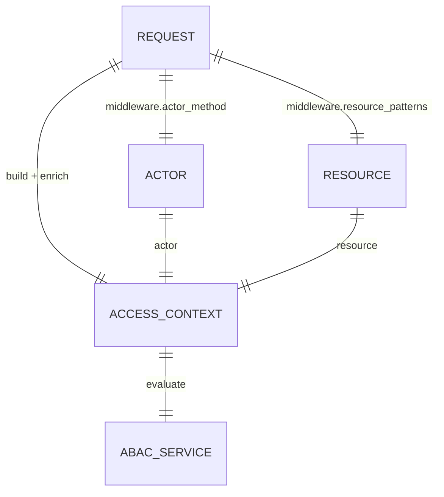

# Consumer Setup Guide

This package provides the ABAC engine and middleware alias (`abac`), but it does not register management routes.

## Request resolution diagram



## 1) Publish configuration

```bash
php artisan abac:publish-config
php artisan abac:publish-env
```

## 2) Configure resource patterns

Map route shapes to model classes used as ABAC resources.

```php
'middleware' => [
    'actor_method' => env('ABAC_MIDDLEWARE_ACTOR_METHOD', 'user'),
    'allow_if_unmatched_route' => env('ABAC_ALLOW_IF_UNMATCHED_ROUTE', false),
    'resource_patterns' => [
        'posts/([^/]+)' => App\Models\Post::class,
        'users/([^/]+)/posts/([^/]+)' => App\Models\Post::class,
    ],
],
```

## 3) Primary-key compatibility

If your models use UUID/custom PKs:

```dotenv
ABAC_PRIMARY_KEY=id
ABAC_FALLBACK_PRIMARY_KEY=_id
```

Set the model PK normally (`$primaryKey`, `$incrementing`, `$keyType`).

## 4) Add middleware to protected routes

```php
Route::middleware(['auth', 'abac'])->group(function () {
    Route::get('/posts/{post:slug}', [PostController::class, 'show']);
});
```

## 5) Access evaluation result in handlers

Enable request macro registration in your app boot:

```php
\zennit\ABAC\Facades\Abac::macros();
```

Then access:

```php
$result = $request->abac();
```

## 6) Production defaults

Use the hardened profile and rollout sequence from [Operations Guide](OPERATIONS.md).

## 7) Optional extension hooks

You can override internals by binding these contracts in your app container:

- `zennit\ABAC\Contracts\PolicyRepository`
- `zennit\ABAC\Contracts\ContextEnricher`
- `zennit\ABAC\Contracts\ResourceResolver`
- `zennit\ABAC\Contracts\ActorResolver`
- `zennit\ABAC\Contracts\CacheKeyStrategy`

## 8) Available artisan commands

```bash
php artisan abac:publish
php artisan abac:publish-config
php artisan abac:publish-env
php artisan abac:scaffold --from-routes
```

- `abac:publish` publishes config and env variables together.
- `abac:publish-config` publishes the package config file.
- `abac:publish-env` appends missing ABAC variables to a target env file.
- `abac:scaffold --from-routes` generates a starter JSON policy scaffold from configured route resource mappings.
