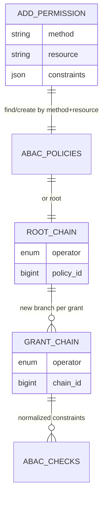

# Managing Permissions

Use the `Abac` facade permission methods as the primary management entrypoint.

## Grant lifecycle diagram



## Terminology

- `resource` means the model being accessed.
- `actor` means the requester context.

Constraints must use `resource.*`, `actor.*`, or `environment.*` keys.

## Primary API

```php
use zennit\ABAC\Facades\Abac;

$grant = Abac::addPermission('read', App\Models\Post::class, [
    'role' => 'editor', // shorthand defaults to actor.role
    'resource.owner_id' => '123',
]);

$all = Abac::getPermissions('read', App\Models\Post::class);
$one = Abac::getPermission($grant->id);

$updated = Abac::updatePermission($grant->id, [
    ['key' => 'actor.role', 'operator' => 'equals', 'value' => 'admin'],
    ['key' => 'resource.owner_id', 'operator' => 'equals', 'value' => '123'],
]);

Abac::removePermission($grant->id);
```

## Behavior

- `addPermission` widens access by adding an OR branch.
- Duplicate grants are idempotent and return the existing grant.
- `updatePermission` replaces constraints for only that grant.
- `removePermissions` supports method/resource scoped bulk cleanup.

## Operational guidance

- Gate ABAC management endpoints behind privileged roles.
- Log permission changes in your app audit logs.
- Run automated tests around each permission branch before promoting changes.
