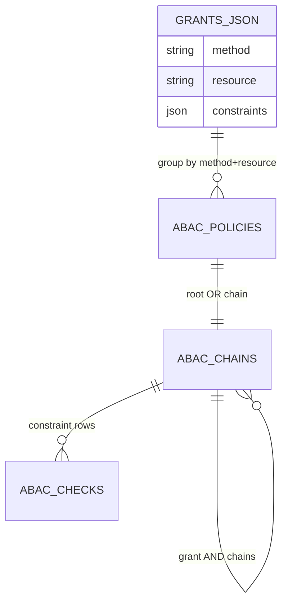

# Seeding JSON Schema

The package storage is still `policies + chains + checks`, but grants are now the preferred conceptual model.

## Preferred grant shape

```json
{
  "grants": [
    {
      "method": "read",
      "resource": "App\\Models\\Post",
      "constraints": [
        { "key": "actor.role", "operator": "equals", "value": "editor" },
        { "key": "resource.owner_id", "operator": "equals", "value": "123" }
      ]
    }
  ]
}
```

## Constraint rules

- Use only `actor.*`, `resource.*`, and `environment.*` prefixes.
- Shorthand keys (when using facade API, not JSON) default to `actor.*`.
- `method` must match supported policy methods (`read`, `create`, `update`, `delete`).

## Storage mapping

- One policy per `(method, resource)`.
- One root OR chain per policy.
- Each grant becomes one AND child chain.
- Each constraint becomes one check row.

## Seeder mapping diagram


